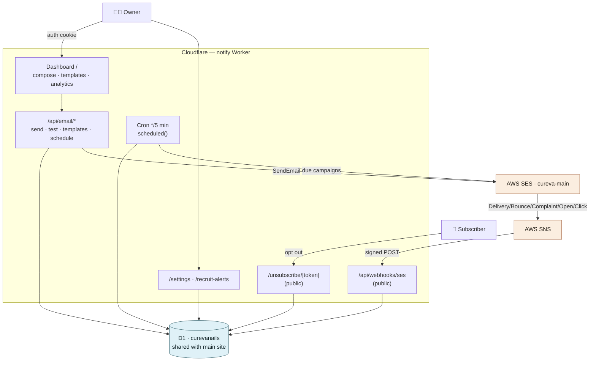
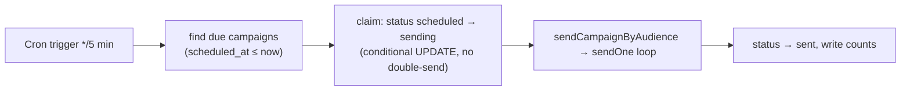
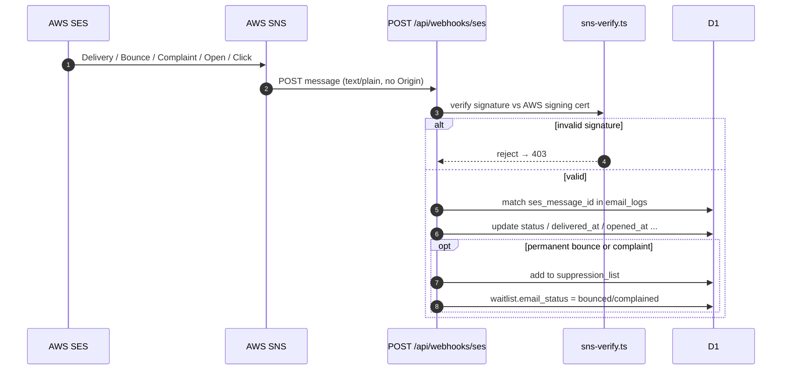
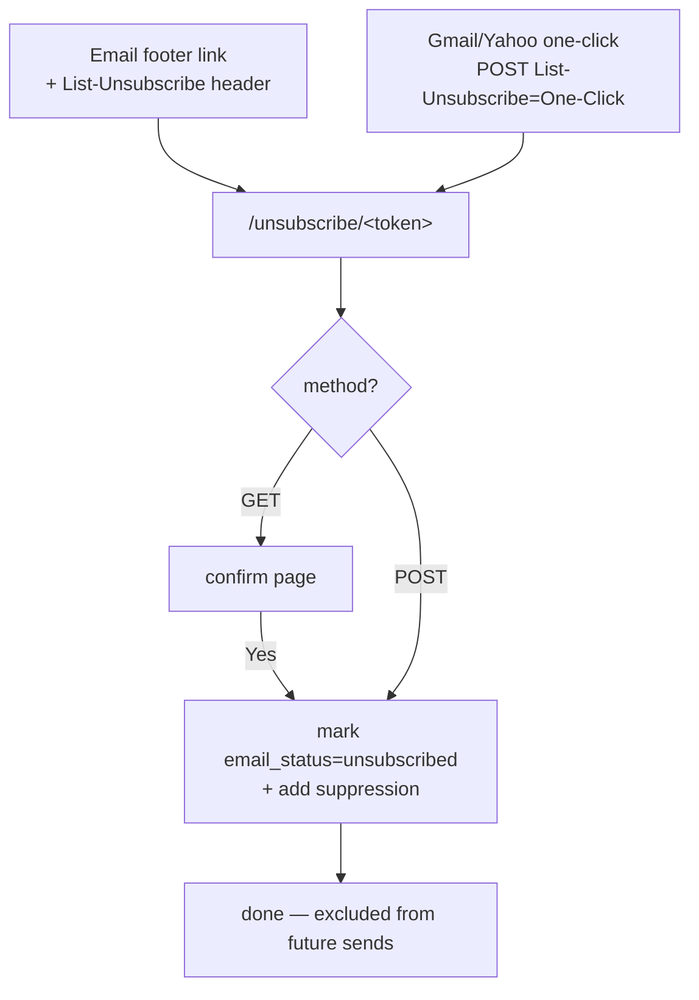
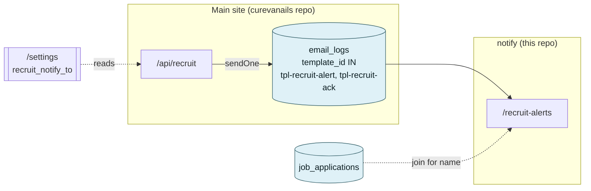
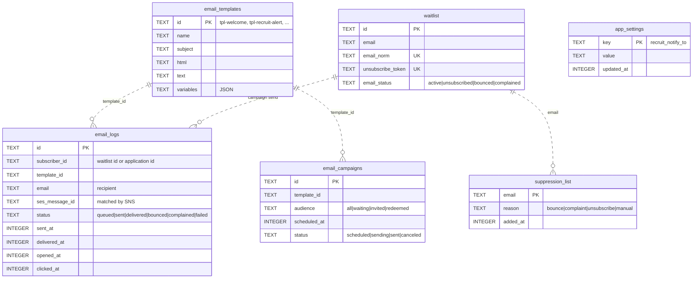

# notifications-service — Architecture

The CureVà email service: a single Cloudflare Worker (`notify`) that sends
templated email through **AWS SES**, tracks delivery via **AWS SNS**, and gives
the owner a dashboard to compose campaigns, manage templates, and see recruit
alerts. Diagram-first, for humans and AI agents.

> **Key fact:** this Worker shares the **same D1 database** as the main CureVà
> site (`curevanails`, id `fcc8f06b-…`). The `waitlist` table *is* the subscriber
> list; `email_logs` holds every send — including the recruit emails the main
> site sends. No cross-service API calls: the two sides cooperate through D1.

For the platform-wide view (all four Workers), see the main repo's
[`docs/ARCHITECTURE.md`](https://github.com/curevanails/curevanails/blob/main/docs/ARCHITECTURE.md).

---

## 1. Topology



**Routes at a glance**

| Path | Auth | Purpose |
| --- | --- | --- |
| `/` | 🔒 cookie | dashboard: compose, templates, analytics, activity |
| `/settings` | 🔒 cookie | edit `recruit_notify_to` (recruit-alert recipient) |
| `/recruit-alerts` | 🔒 cookie | list of recruit emails (from `email_logs`) |
| `/api/email/{send,test,templates,schedule}` | 🔒 cookie | campaign actions |
| `/api/settings` | 🔒 cookie | save settings |
| `/login` · `/logout` | public | sign in / out |
| `/unsubscribe/[token]` | public (token) | one-click + on-page opt-out |
| `/api/webhooks/ses` | public (SNS-signed) | delivery events |

Auth is the same signed-cookie scheme as the main site (`src/middleware.ts` +
`src/utils/admin-auth.ts`): protected paths without a valid
`cureva_admin_session` cookie redirect to `/login`; if `ADMIN_PASSWORD` is unset
the dashboard 404s.

---

## 2. Campaign send flow

Composing and sending to an audience of active subscribers.

```mermaid
sequenceDiagram
    autonumber
    actor O as Owner
    participant D as Dashboard /
    participant S as POST /api/email/send
    participant DB as D1
    participant SES as AWS SES

    O->>D: pick template + audience, Send
    D->>S: JSON { template_id, audience }
    S->>S: validate; build SES client (500 if secrets unset)
    S->>DB: load template + resolve recipients<br/>(waitlist where email_status='active')
    loop each recipient (≈12/sec)
        S->>DB: INSERT email_logs (queued)
        S->>DB: suppression precheck
        S->>SES: SendEmail (+ List-Unsubscribe headers)
        S->>DB: UPDATE email_logs (sent / failed)
    end
    S-->>D: summary { total, sent, failed }
```

- **`sendOne`** (`src/utils/email/send-service.ts`) is the unit of work: render
  (Handlebars) → log → send → update. It is reused by immediate sends, scheduled
  sends, and the main site's recruit emails, so all behave identically.
- **Suppression is checked before every send** — unsubscribed / bounced /
  complained addresses are never emailed.
- Sends are spaced (~80 ms) to stay under the SES rate limit.

### Scheduled campaigns (Cron)



Scheduling times are stored as absolute Unix-ms, so the runner is
timezone-agnostic; the dashboard does the Utah (America/Denver) conversion when a
campaign is created.

---

## 3. SES → SNS event flow (delivery tracking)

Every send is later reconciled with what actually happened, via signed SNS
notifications.



- **Signature verification is mandatory** (`sns-verify.ts`, WebCrypto, no deps)
  before any event is acted on — the endpoint is public, so the signature is the
  trust boundary.
- CSRF `checkOrigin` is **disabled** (`astro.config.mjs`) precisely because SNS
  posts `text/plain` with no `Origin`; without that, every event would be
  rejected with a 403. Protection is the signature + auth gate instead.

---

## 4. Unsubscribe (link + one-click)



- Every email carries `{{unsubscribe_url}}` **and** the RFC 8058 headers
  `List-Unsubscribe` + `List-Unsubscribe-Post: List-Unsubscribe=One-Click`, which
  render the native Unsubscribe button in Gmail/Apple Mail (required for bulk
  senders). See [`EMAIL.md`](EMAIL.md).
- The token is the credential — no login. One-click and on-page both hit the
  same handler.

---

## 5. Recruit alerts (cross-repo, via shared D1)

The main site sends the recruiter alert + candidate acknowledgement (as system
templates) through the shared send path, so they land in `email_logs`. This
dashboard just surfaces them.



- **`/settings`** edits `recruit_notify_to` in the shared `app_settings` table;
  the main site reads it to decide who gets the recruiter alert.
- **`/recruit-alerts`** reads `email_logs` filtered to the two recruit template
  ids, joined to `job_applications` for the candidate name (falls back to a
  name-less list if that table isn't present yet).

---

## 6. Data model (email tables)



All tables are lazily created (`ensureEmailSchema`, `app-settings.ts`) — no
migration step. Email timestamps are Unix-ms integers.

---

## 7. Where things live

```
src/
├─ middleware.ts                 auth gate (/ , /settings, /recruit-alerts, /api/*)
├─ pages/
│  ├─ index.astro                dashboard: compose / templates / analytics / activity
│  ├─ settings.astro             edit recruit_notify_to
│  ├─ recruit-alerts.astro       recruit emails list (reads email_logs)
│  ├─ login.astro · logout.ts    auth
│  ├─ unsubscribe/[token].astro  public opt-out (link + one-click POST)
│  └─ api/
│     ├─ email/{send,test,templates,schedule}.ts   campaign actions
│     ├─ settings.ts             save settings
│     └─ webhooks/ses.ts         SNS receiver (signed)
├─ utils/
│  ├─ email-db.ts                email tables + default/system templates
│  ├─ app-settings.ts            shared key/value store
│  ├─ recruit-notifications.ts   read recruit emails from email_logs
│  └─ email/
│     ├─ ses-client.ts           SES send + List-Unsubscribe + suppression precheck
│     ├─ send-service.ts         sendOne + campaign loop
│     ├─ campaigns.ts            cron: run due scheduled campaigns
│     └─ sns-verify.ts           SNS signature verification
└─ worker.ts                     fetch + scheduled() (cron) handlers
```

---

## 8. Deep-dive docs

| Doc | Covers |
| --- | --- |
| [`EMAIL.md`](EMAIL.md) | SES setup, templates, secrets, SNS webhook, unsubscribe, one-click |
| [`TESTING.md`](TESTING.md) | Playwright E2E suite + the deploy-after-E2E pipeline |
| main repo `docs/ARCHITECTURE.md` | The whole platform (four Workers, recruit flow) |

> Diagrams are [Mermaid](https://mermaid.js.org/) blocks — GitHub and most
> Markdown viewers render them natively, no build step.
